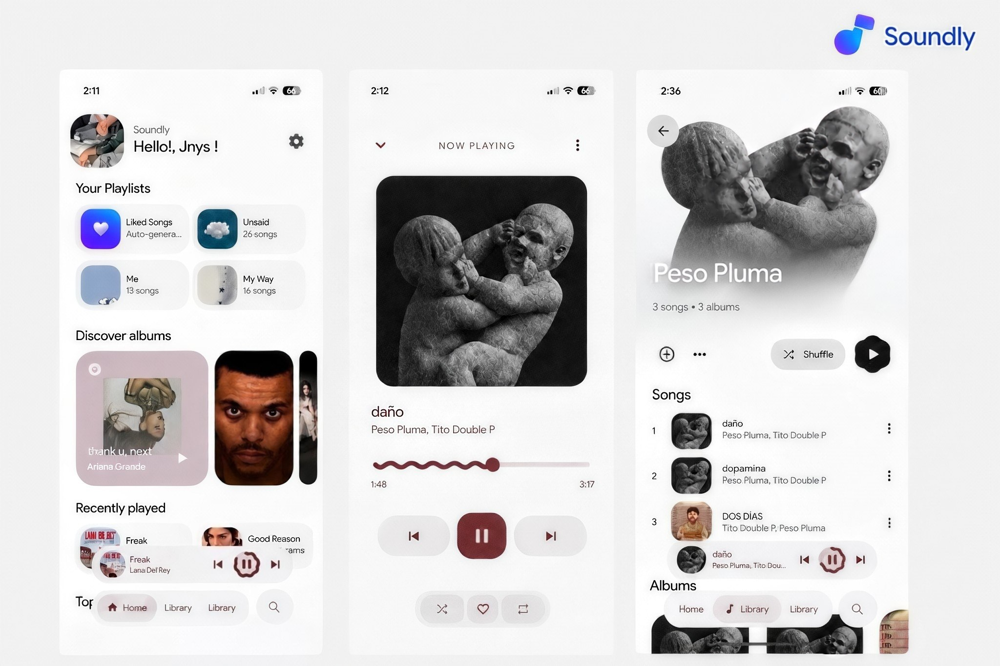

  <h1>Soundly</h1>
  
<b>Un poderoso reproductor de música local y en la nube para Android</b>

  
  <!-- Imagen añadida justo aquí -->
  
    

  <!-- Badges de Estado y Tecnologías -->
  
  
  
   
  
  

---

## Descripción

**Soundly** es un reproductor de música moderno enfocado en brindar una experiencia de usuario fluida, elegante y altamente personalizable. 

La aplicación combina la potencia del lenguaje Kotlin y **Jetpack Compose**, adaptándose a la estética de **Material 3 Expressive** con colores dinámicos y una interfaz intuitiva. Ofrece lo mejor de dos mundos: la gestión fluida de tu biblioteca local y la integración con contenido en línea mediante el módulo **Soundly Cloud**.

---

## Características Principales

### Biblioteca Local (Music Library)
* **Inicio Inteligente:** Recomendaciones basadas en tus hábitos de escucha.
* **Reproductores Personalizables:** Elige entre **2 estilos de player** según tu preferencia visual.
* **Gestión de Letras:** Soporte para archivos de letras locales (`.lrc`) y sincronización de letras en línea.
* **Playlists:** Crea, edita, organiza y elimina tus listas de reproducción fácilmente.
* **Navegación Flexible:** Explora por carpetas, álbumes, artistas y listas dedicadas.
* **Búsqueda Avanzada:** Encuentra rápidamente cualquier pista o artista en tu colección.

### Módulo Soundly Cloud
* **Contenido Online:** Acceso e integración a recomendaciones y listas desde la nube.
* **Búsqueda Global:** Explora canciones, álbumes, artistas, playlists y videos en tiempo real.
* **Descarga de Canciones:** Descarga contenido en línea para ampliar tu biblioteca local y escucharlo offline.

---

## Tecnologías y Requisitos

* **Lenguaje:** Kotlin
* **UI Toolkit:** Jetpack Compose (Material 3 Expressive)
* **Compatibilidad:** Android 13 (API 33) en adelante
* **Estado:** Activo en desarrollo

---

## Capturas de Pantalla

*(Reemplaza las rutas de las imágenes con las capturas de tu app)*

| Inicio / Player | Biblioteca | Soundly Cloud |
| :---: | :---: | :---: |
|  |  |  |

---

  Desarrollado para Android.

